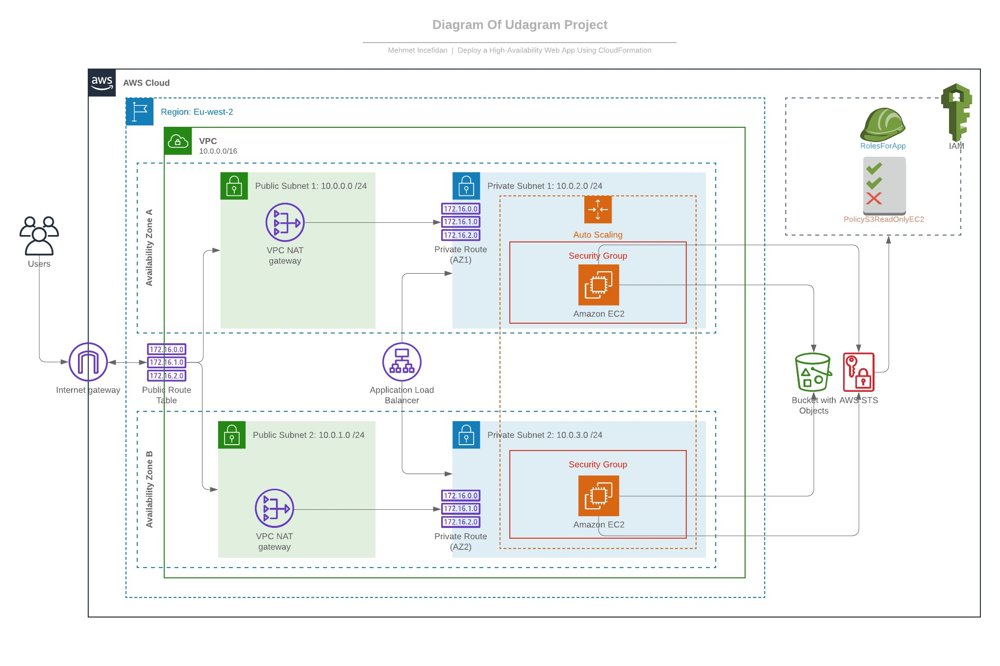

# Project 2 - Deploy a High-Availability Web App using CloudFormation 



> In this project (Udagram App), I deployed web servers for a highly available web app using CloudFormation.
> I wrote the script that creates and deploys the infrastructure and application for an Udagram app from the ground up.
> The script begin deploying the networking components followed by servers, security roles and software.

## The files included are:
```sh
* /Images-of-result-deploy : Screenshot the result of deploy.
* /App of Udagram : Udagram App Code (Bootssrap CSS framework, Font, and JavaScript libraries needed for the website to function etc ...)
* create.sh : Cloudformation create stack script. 
* update.sh : Cloudformation update stack script.
* destroy.sh : Cloudformation delete stack script.
* infrastructure_networkandserver.yml : Udagram Project's CloudFormation script.
* infrastructure_networkandserver.json : Udagram Project's CloudFormation script parameters.
```
## Instruction of deploy:

Just run;
```sh
> ./create.sh UdagramApp infrastructure_networkandserver.yml infrastructure_networkandserver.json
```
